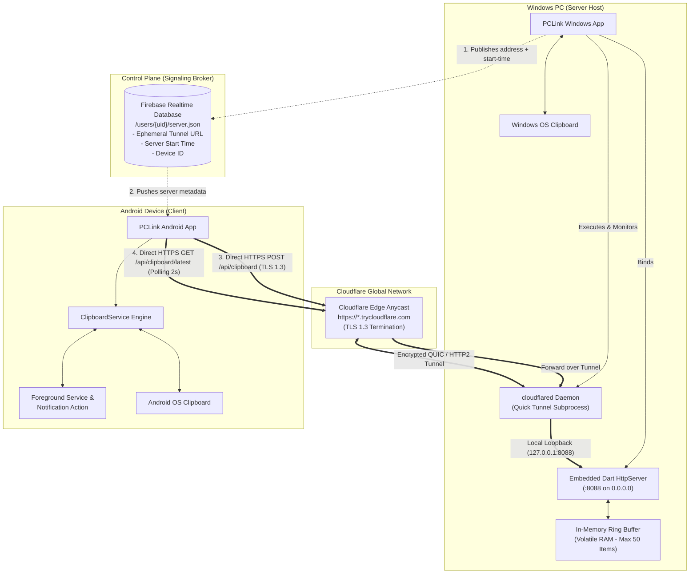
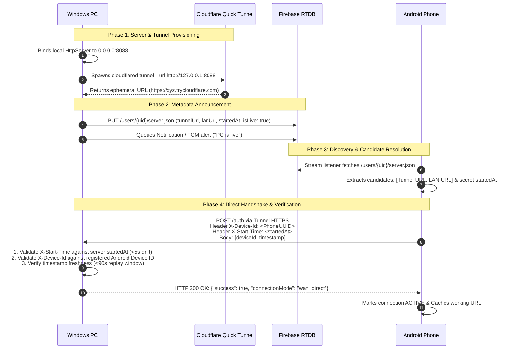
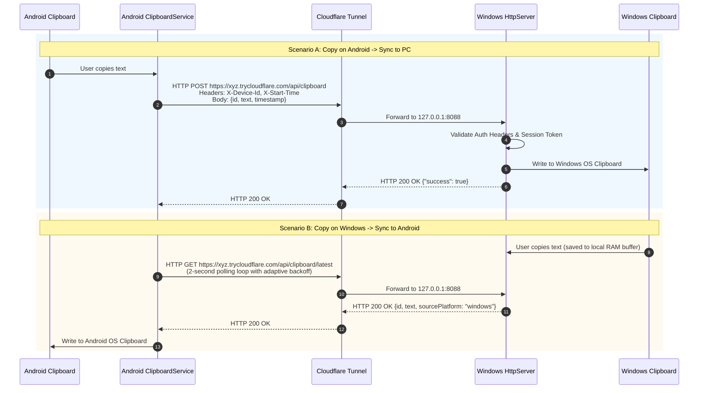

# Temporary Server & Direct Connection Architecture in PCLink

This document provides a comprehensive technical breakdown of PCLink's **temporary local server**, its **automated public tunnel**, the **connection establishment handshake**, **peer-to-peer data transfer mechanics**, **security guarantees**, and the **exact role of the database**.

---

## 1. Executive Summary

In PCLink, clipboard synchronization is designed around a **Direct Peer-to-Peer Data Plane** paired with an **Asynchronous Cloud Control Plane (Signaling)**:

1. **Temporary Embedded Server**: The Windows app spins up a lightweight embedded HTTP server listening locally on port `8088`.
2. **Ephemeral Quick Tunnel**: To punch through NATs, firewalls, and CGNAT (Carrier-Grade NAT) without router port-forwarding or user accounts, the app automatically downloads and launches Cloudflare's `cloudflared` CLI. This generates an ephemeral public HTTPS endpoint (`https://<random>.trycloudflare.com`).
3. **Database as Control Plane Only**: Firebase Realtime Database (RTDB) is strictly used as a **signaling beacon** to share the server's ephemeral address, session timestamp (session password), and device identities.
4. **Zero-Database Payload Transit**: **No clipboard text or payload ever enters Firebase RTDB.** All copied data travels directly between Android and Windows over HTTPS/HTTP.

---

## 2. High-Level Architecture Diagram



---

## 3. The Temporary Server: Components & Mechanics

### 3.1 Embedded Local HTTP Server (`ServerService.dart`)
- **Location**: [server_service.dart](file:///c:/Users/Admin/Documents/Mohit/pclink/lib/data/services/server_service.dart)
- **Engine**: Native Dart `HttpServer.bind(InternetAddress.anyIPv4, 8088, shared: true)`.
- **Endpoints Exposed**:
  - `GET /health`: Health check and host identity info.
  - `POST /auth`: Client verification and mutual handshake.
  - `POST /api/clipboard`: Push clipboard content from Android into PC.
  - `GET /api/clipboard/latest`: Fetch the most recent clip copied on PC.
  - `GET /api/clipboard`: Retrieve full in-memory history.
  - `DELETE /api/clipboard`: Clear in-memory history.
  - `GET /status`: Query server runtime statistics and state.

```dart
// Snippet from lib/data/services/server_service.dart
_server = await HttpServer.bind(
  InternetAddress.anyIPv4,
  port,
  shared: true,
);
```

### 3.2 Automated Ephemeral Tunnel (`TunnelService.dart`)
- **Location**: [tunnel_service.dart](file:///c:/Users/Admin/Documents/Mohit/pclink/lib/data/services/tunnel_service.dart)
- **Automatic Provisioning**:
  1. On first run, PCLink checks `%APPDATA%\pclink\cloudflared.exe`.
  2. If missing, it downloads the official ~30 MB release directly from `github.com/cloudflare/cloudflared`.
  3. Launches: `cloudflared tunnel --url http://127.0.0.1:8088 --no-autoupdate`.
  4. Parses standard output streams for the regex pattern `https://[a-zA-Z0-9-]+[.]trycloudflare[.]com`.
  5. Yields the ephemeral URL through a reactive Dart stream (`urlStream`).
  6. Automatically restarts the daemon if it unexpectedly terminates.

---

## 4. Connection Establishment & Handshake Process

The connection lifecycle transitions through 4 distinct phases:



### Detailed Handshake Verification Steps
When Android initiates the handshake to `POST /auth`:

1. **Session Password Verification (`X-Start-Time`)**:
   - The phone passes the `startedAt` timestamp it received from Firebase RTDB in the `X-Start-Time` header.
   - The PC checks if `|startedAt - candidate| < 5 seconds`.
   - **Purpose**: Prevents anyone scanning or stumbling upon the public `trycloudflare.com` URL from authenticating or querying the server.

2. **Device Hardware Binding (`X-Device-Id`)**:
   - The PC reads the authorized Android `deviceId` previously registered in Firebase RTDB (`/users/{uid}/devices/android/deviceId.json`).
   - Rejects any client whose device ID does not match.

3. **Replay Attack Defense**:
   - The request contains a timestamp. The PC validates that `|DateTime.now() - requestTimestamp| <= 90 seconds`.

---

## 5. Data Transfer Mechanics (Clipboard Sync)



### Adaptive Multi-URL Fallback
The Android client implements resilient adaptive routing in [clipboard_service.dart](file:///c:/Users/Admin/Documents/Mohit/pclink/lib/features/clipboard/services/clipboard_service.dart):
1. **Candidate Priority**: Ephemeral Tunnel HTTPS URL first, followed by Local LAN IP URL.
2. **Sticky Routing**: Once an address successfully returns `200 OK`, `ClipboardService` locks onto `_workingServerUrl` for subsequent calls.
3. **Progressive Backoff**: If both addresses fail, polling backs off exponentially (`5s → 10s → 15s → 20s → 30s`) to conserve phone battery and eliminate thread congestion.
4. **Immediate Recovery**: As soon as user copies locally or Firebase publishes a new server session, the backoff is cleared immediately.

---

## 6. Involvement of the Database (Firebase RTDB)

A cornerstone of PCLink's security and privacy design is the **strict separation between Control Plane and Data Plane**.

### 6.1 What the Database DOES Do (Control Plane / Signaling)
The database operates exclusively as a **rendezvous beacon**:

| Node Path | Data Stored | Frequency of Update |
|---|---|---|
| `/users/{uid}/devices/windows` | Device name, OS version, LAN IP, last seen | Once at app boot / login |
| `/users/{uid}/devices/android` | Device name, Device hardware UUID, FCM Push token | Once at app boot / login |
| `/users/{uid}/server.json` | Ephemeral tunnel URL (`trycloudflare.com`), LAN URL, server port, `startedAt` timestamp, heartbeat | At server boot and when tunnel generates |
| `/users/{uid}/notifications/latest` | Alert badge informing Android that PC server is live | When PC server starts |
| `/users/{uid}/channel/*` | Optional fallback handshake signal if direct HTTP is blocked | Rarely (only on extreme firewall restrictions) |

### 6.2 What the Database NEVER Touches (Zero Data Plane Exposure)
- ❌ **No clipboard contents**: Copied text, links, passwords, and sensitive snippets are **NEVER** sent to Firebase RTDB.
- ❌ **No clipboard metadata**: Clip lengths, timestamps of copied clips, or copy frequencies are **NEVER** logged in the database.
- ❌ **No persistent storage on cloud**: If Firebase is inspected or compromised, zero user data exists there—only device IDs and ephemeral URLs.

---

## 7. Security Level & Threat Model Analysis

PCLink delivers an **Enterprise-Grade Direct Security Profile** for personal cross-device syncing:

| Security Domain | Implementation in PCLink | Protection Level | Threat Mitigated |
|---|---|:---:|---|
| **Data in Transit** | TLS 1.3 / HTTPS via Cloudflare edge Anycast network; valid SSL/TLS certificates | **Very High** | Eavesdropping, Man-in-the-Middle (MITM) on public Wi-Fi/cellular |
| **Authentication** | Dual-Token: Device UUID (`X-Device-Id`) + Ephemeral `startedAt` session token (`X-Start-Time`) | **High** | Unauthorized requests, URL scrapers, port-scanners |
| **Replay Attacks** | Handshake timestamp validated within 90-second skew window | **High** | Intercepted packet replay |
| **Data at Rest** | Volatile RAM only (`_clipboardHistory` capped at 50 items). Wiped on process termination | **Maximum** | Cold-disk forensics, unencrypted storage leaks |
| **Network Perimeter** | Zero port-forwarding on router. No inbound open ports required on WAN | **High** | Inbound WAN automated vulnerability exploits |
| **HTTP Hardening** | `X-Content-Type-Options: nosniff`, `X-Frame-Options: DENY`, strict CORS | **Standard** | Browser-origin injection |

---

## 8. Summary Comparison: Temp Server vs Traditional Cloud Sync

| Feature | PCLink Temporary Server | Traditional Cloud Clipboard Sync |
|---|---|---|
| **Data Storage Location** | RAM of your devices only | Cloud vendor servers (AWS/Firebase/GCP) |
| **Privacy Risk** | Zero cloud exposure of clipboard content | Clipboard readable by cloud DB / DB leaks |
| **Connection Setup** | Zero configuration (Automated Cloudflare Quick Tunnel) | Requires static cloud database subscription |
| **NAT Traversal** | Outbound tunnel bypasses CGNAT and firewalls | Relay via third-party database |
| **Bandwidth Limits** | Unlimited direct transfer | Bound by cloud database rate limits/billing |
| **Session Lifetime** | Ephemeral: dies when PCLink on Windows exits | Persistent in cloud database until purged |

---

*Authored for the PCLink Architecture Documentation suite.*
